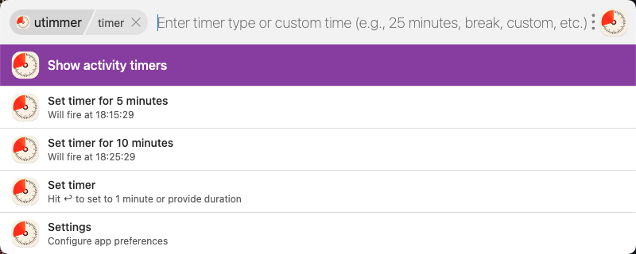
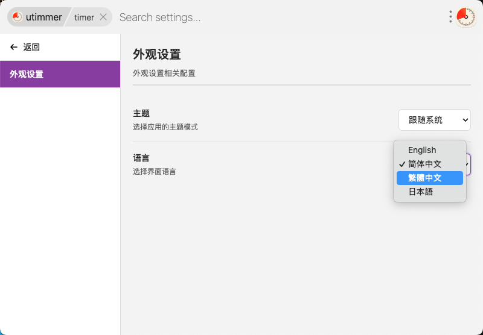

# uTools 桌面定时器插件

一个功能强大、界面精美的 uTools 定时器插件，支持自定义时间、任务管理、主题切换等功能。

## 🖼️ 界面预览

以下是插件的主要界面截图：

<div align="center">
  
  <p>白天模式界面</p>
</div>

<div align="center">
  
  <p>黑夜模式界面</p>
</div>

<div align="center">
  
  <p>设置界面</p>
</div>

## ✨ 主要特性

### 🎯 核心功能
- **预设定时器**: 快速启动 5 分钟、10 分钟等常用定时器
- **自定义时间**: 支持输入任意时间（如：25分钟、1小时30分、90秒）
- **智能解析**: 自动识别中文输入（分钟、小时、秒）
- **任务管理**: 查看和管理当前运行中的定时器
- **历史记录**: 所有定时器任务自动保存到数据库

### 🎨 界面特性
- **自定义 UI**: 精心设计的现代化界面
- **主题自动切换**: 跟随 uTools 系统主题（深色/浅色）
- **动态高度**: 界面高度根据内容自动调整
- **流畅动画**: 快速响应，几乎无感的界面切换

### ⌨️ 交互优化
- **键盘导航**: 支持上下键选择、回车确认
- **鼠标操作**: 支持鼠标悬停选中、点击确认
- **智能切换**: 键盘和鼠标模式智能切换，互不干扰
- **防误触**: 进入插件时自动禁用鼠标悬停选中

### 🎬 实时更新
- **秒级精度**: 结束时间显示精确到秒（HH:MM:SS）
- **动态刷新**: 每秒自动更新显示内容
- **智能暂停**: 在子视图中自动暂停刷新，避免干扰

### ⚙️ 设置页面
- **类文档模式**: 左侧分类列表，右侧详细设置
- **实时搜索**: 支持搜索设置项关键词
- **Mock 数据**: 包含通用、通知、外观、高级等设置分类
- **开关控件**: 美观的开关样式，支持即时切换

### 📊 数据库存储
- **任务记录**: 每个定时器任务都会保存到 uTools 数据库
- **状态跟踪**: 记录任务的创建、开始、完成状态
- **自动清理**: 定期清理过期记录
- **历史查看**: 可查看和管理历史任务

## ⚠️ 重要提示和使用限制

### 关于定时器提醒的可靠性

由于 uTools 插件的架构限制，定时器的触发依赖于以下条件：

**✅ 可靠场景**（触发率 99%）
- uTools 保持运行状态
- 电脑未休眠/关机
- 短期定时器（5分钟 - 2小时）

**⚠️ 可能延迟场景**（需重新打开插件）
- uTools 运行但插件未激活
- 延迟时间：1-5秒（打开插件时会立即检查并触发）

**❌ 无法触发场景**
- 电脑关机/休眠后
- uTools 未运行时
- 长时间离开电脑

### 推荐的使用方式

**最佳实践：**
1. ✅ 将 uTools 设置为开机自启动
2. ✅ 保持 uTools 在后台运行（不要完全退出）
3. ✅ 主要用于需要在电脑前工作时的短期提醒
4. ✅ 重要提醒请结合手机闹钟或系统日历作为备份

**适用场景：**
- ✅ 番茄工作法（25分钟专注 + 5分钟休息）
- ✅ 定期休息提醒（每小时休息一次）
- ✅ 会议/任务倒计时
- ✅ 烹饪/泡茶等短时间提醒

**不适用场景：**
- ❌ 需要跨设备同步的提醒
- ❌ 电脑可能关机的长期定时器
- ❌ 关键重要事项的唯一提醒方式

### 技术原理

插件使用了双重保障机制：
- **主机制**：JavaScript `setTimeout` 精确触发
- **备份机制**：定期检查器每 5-10 秒检查一次过期定时器
- **智能优化**：临近到期时提高检查频率，减少延迟

详细的技术说明请参考：[TIMER_OPTIMIZATION.md](./TIMER_OPTIMIZATION.md)

## 🚀 使用方法

### 启动定时器

在 uTools 中输入 `timer` 或 `定时器`，然后：

1. **预设定时器**
   - 选择 "Set timer for 5 minutes"
   - 选择 "Set timer for 10 minutes"
   
2. **自定义时间**
   - 直接输入时间：`25分钟`、`1小时`、`90秒`
   - 或选择 "Set timer" 进入自定义模式

3. **输入提示信息**
   - 选择定时器后，输入提示信息（如：专注工作、休息时间）
   - 按回车确认

### 管理任务

- **查看活动定时器**: 选择 "Show activity timers"
- **修改时间**: 在任务列表中选择任务，然后选择 "Set new time"
- **取消定时器**: 在任务列表中选择任务，然后选择 "Cancel timer"

### 设置选项

- 选择 "Settings" 进入设置页面
- 使用左侧分类切换不同设置
- 使用搜索框快速查找设置项
- 点击 "← 返回" 回到主界面

## 🎨 界面主题

插件自动跟随 uTools 的系统主题：

- **浅色主题**
  - 背景：白色/浅灰
  - 选中：紫色 (#8e44ad)
  - 文字：深色

- **深色主题**
  - 背景：深灰/灰色
  - 选中：蓝色 (#3a9cb8)
  - 文字：浅色

## 📁 项目结构

```
utoolstimer/
├── plugin.json          # 插件配置文件
├── main.html           # 主界面（自定义 UI）
├── main-preload.js     # 主界面预加载脚本
├── index.js            # 业务逻辑核心
├── database.js         # 数据库操作
├── i18n.js             # 国际化配置文件
├── timer.html          # 定时器提醒窗口
├── timer-preload.js    # 提醒窗口预加载脚本
├── README.md           # 项目文档
└── icons/              # 图标资源
    ├── logo.png
    ├── list.png
    ├── add.png
    ├── edit_time.png
    ├── cancel.png
    └── back.png
```

## 🗂️ 数据格式

每个定时器任务包含以下信息：

```json
{
  "_id": "timer_task_timer_1234567890_abc123",
  "type": "timer_task",
  "taskId": "timer_1234567890_abc123",
  "name": "Set timer for 5 minutes",
  "message": "专注工作时间",
  "duration": 300,
  "endTime": 1234567890000,
  "status": "running",
  "createdAt": "2025-10-15T10:30:00.000Z",
  "startedAt": "2025-10-15T10:30:05.000Z"
}
```

### 状态说明
- `pending`: 待启动
- `running`: 运行中
- `completed`: 已完成
- `cancelled`: 已取消

## ⚙️ 技术特性

### 性能优化
- **高度调整优化**: 从 150ms 延迟优化到单帧（~16ms）
- **智能防抖**: 使用 requestAnimationFrame 确保流畅
- **CSS 优化**: 只对颜色属性做过渡动画，避免布局抖动
- **事件优化**: 智能管理键盘/鼠标事件，避免冲突

### 用户体验
- **无感切换**: 页面高度变化几乎无感
- **防止跳回**: 键盘导航时不受鼠标位置影响
- **避免闪烁**: 选中状态不与悬停状态冲突
- **智能预估**: 渲染前预估高度，减少视觉跳动

### 数据管理
- **自动维护**: 插件启动时自动清理过期数据
- **状态管理**: 实时更新任务状态
- **类型识别**: 根据定时器名称自动分类
- **扩展性**: 数据格式支持未来功能扩展

## 🎯 键盘快捷键

- `↑` / `↓` : 上下选择
- `Enter` : 确认选择
- `Esc` : 关闭定时器提醒窗口

## 🔧 开发说明

### 依赖
- uTools API v2.0.0+
- Node.js (用于 preload 脚本)

### 调试
1. 在 uTools 开发者工具中加载插件
2. 查看控制台输出（已清理大部分调试日志）
3. 错误信息会通过 `console.error` 输出

### 设置页面扩展
设置数据定义在 `main.html` 的 `settingsData` 中，可以轻松添加新的设置项：

```javascript
{
  id: 'category_id',
  title: '设置分类名称',
  options: [
    {
      id: 'option_id',
      title: '设置项标题',
      description: '设置项描述',
      type: 'switch',  // 或 'button'
      value: true
    }
  ]
}
```

## 🌍 国际化（i18n）

### 支持的语言

插件目前支持以下语言：

- 🇬🇧 **English**（英文）- 默认语言
- 🇨🇳 **简体中文**
- 🇹🇼 **繁體中文**
- 🇯🇵 **日本語**（日语）

### 切换语言

1. 在主界面选择 "Settings"（设置）
2. 在语言下拉框中选择您想要的语言
3. 界面将立即切换到所选语言

### 添加新语言

所有的国际化配置都在 `i18n.js` 文件中，添加新语言非常简单：

#### 步骤 1：添加语言包

在 `i18n.js` 的 `i18nMessages` 对象中添加新语言：

```javascript
const i18nMessages = {
    'en': { /* 英文 */ },
    'zh-CN': { /* 简体中文 */ },
    'fr': {  // 👈 添加法语示例
        inputPlaceholder: 'Entrez le type de minuteur...',
        pomodoro: 'Pomodoro',
        pomodoroDesc: 'Minuteur de travail de 25 minutes',
        // ... 其他翻译（约60个键）
    }
};
```

#### 步骤 2：添加到语言列表

在 `supportedLanguages` 数组中添加：

```javascript
const supportedLanguages = [
    { value: 'en', label: 'English' },
    { value: 'zh-CN', label: '简体中文' },
    { value: 'zh-TW', label: '繁體中文' },
    { value: 'ja', label: '日本語' },
    { value: 'fr', label: 'Français' }  // 👈 添加到这里
];
```

#### 步骤 3：完成

就这么简单！新语言将自动出现在设置页面的语言选择框中。

### 翻译键说明

所有需要翻译的文本都定义为键值对。主要包括：

- **界面元素**：按钮、标题、提示文本
- **定时器预设**：名称和描述
- **状态消息**：错误、成功、提示信息
- **设置项**：设置页面的所有文本

**占位符支持**：某些文本支持动态内容插入
```
willFireAt: '将于 {0} 结束'  // {0} 会被替换为具体时间
timerNotification: '⏰ {0} 时间到！提示: {1}'  // 支持多个参数
```

### 语言代码规范

建议使用标准的 ISO 639-1 语言代码：

| 代码 | 语言 |
|------|------|
| `en` | English（英文） |
| `zh-CN` | 简体中文 |
| `zh-TW` | 繁體中文 |
| `ja` | 日本語（日语） |
| `ko` | 한국어（韩语） |
| `fr` | Français（法语） |
| `de` | Deutsch（德语） |
| `es` | Español（西班牙语） |
| `pt` | Português（葡萄牙语） |
| `ru` | Русский（俄语） |

### 测试新语言

1. 确保 `i18n.js` 语法正确（注意逗号、引号）
2. 重启 uTools 插件
3. 在设置中切换到新语言
4. 检查所有界面文本是否正确显示
5. 测试动态文本（如定时器描述、通知消息）

### 贡献翻译

如果您添加了新语言翻译，欢迎提交 Pull Request！这将帮助更多用户使用本插件。

## 🚀 后续规划

- [ ] 实现设置数据的持久化存储
- [ ] 添加定时器模板功能
- [ ] 支持番茄工作法统计
- [ ] 添加每日/周/月使用报告
- [ ] 支持导入/导出数据
- [ ] 添加更多定时器预设
- [ ] 支持自定义主题色
- [ ] 增加更多语言支持（韩语、法语、德语等）

## 📝 更新日志

### v1.1.0
- ✅ 完整的国际化（i18n）支持
- ✅ 支持 4 种语言（英文、简体中文、繁体中文、日语）
- ✅ 独立的 i18n 配置文件（`i18n.js`）
- ✅ 动态文本翻译（时间描述、通知消息等）
- ✅ 主题设置功能（深色/浅色/跟随系统）
- ✅ 语言设置功能（支持实时切换）

### v1.0.0
- ✅ 自定义 UI 替换官方 list 模式
- ✅ 主题自动切换功能
- ✅ 键盘/鼠标混合导航优化
- ✅ 设置页面（Mock）
- ✅ 高度调整性能优化
- ✅ 实时更新精确到秒
- ✅ 数据库存储和任务管理
- ✅ 清理冗余日志输出

## 📄 许可

MIT License

## 👤 作者

您的名字

## 🙏 致谢

感谢 uTools 提供的优秀插件平台。
